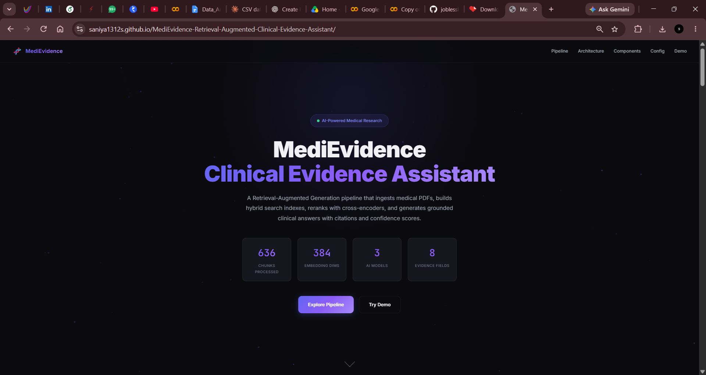
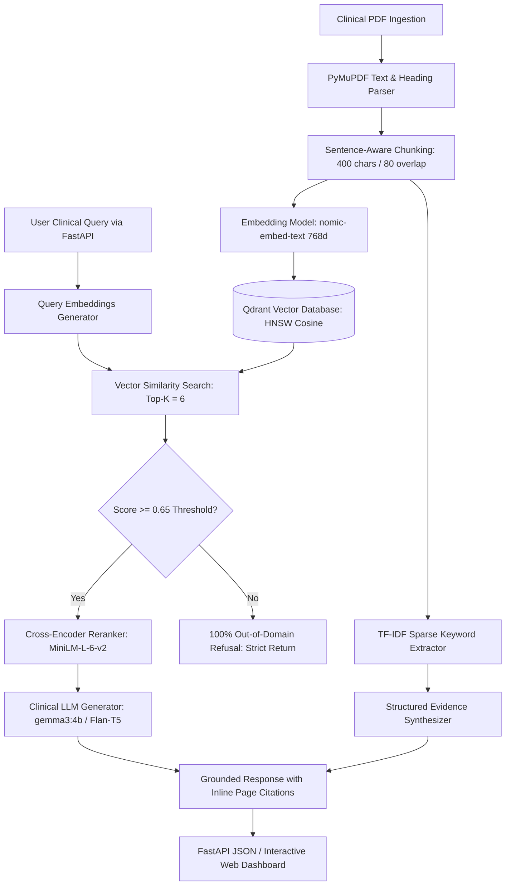

<div align="center">

# 🧬 MediEvidence – Retrieval-Augmented Clinical Evidence Assistant

### Python | FastAPI | Qdrant | Ollama | 2026

[](https://python.org)
[](https://fastapi.tiangolo.com)
[](https://qdrant.tech)
[](https://ollama.ai)
[](https://docker.com)
[](LICENSE)

<br/>


<br/><br/>

<a href="https://Saniya1312S.github.io/MediEvidence-Retrieval-Augmented-Clinical-Evidence-Assistant/" target="_blank">
  
</a>

<br/><br/>

*A clinical-grade Retrieval-Augmented Generation assistant engineered to ingest medical research papers, execute hybrid dense-sparse semantic retrieval, enforce strict out-of-domain refusal guardrails, and generate cited answers with structured PICO evidence.*

<br/>

[🌐 Live Site Demo](https://Saniya1312S.github.io/MediEvidence-Retrieval-Augmented-Clinical-Evidence-Assistant/) · [📸 Dashboard Screenshots](#-live-dashboard--visual-showcase) · [🚀 Quick Start](#-quick-start) · [🏗️ Architecture](#-system-architecture) · [📊 Pipeline](#-end-to-end-clinical-rag-pipeline) · [🛡️ Refusal Benchmark](#-100-out-of-domain-refusal-benchmark) · [📡 API Reference](#-fastapi-rest-api-documentation)

</div>

## 🖥️ Live Dashboard

<div align="center">
  <a href="https://saniya1312s.github.io/MediEvidence-Retrieval-Augmented-Clinical-Evidence-Assistant/" target="_blank">
    
  </a>
  <br/>
  <sub>👉 <b><a href="https://saniya1312s.github.io/MediEvidence-Retrieval-Augmented-Clinical-Evidence-Assistant/">Click here or the image above to launch the live site</a></b></sub>
</div>

## 📌 Executive Summary

> **MediEvidence – Retrieval-Augmented Clinical Evidence Assistant | Python, FastAPI, Qdrant, Ollama 2026**
>
> • **Built a domain-specific AI assistant** to query medical research papers & generate cited answers using an end-to-end RAG pipeline with LLMs, embeddings, Qdrant, and TF-IDF evidence extraction for contextual responses.  
> • **Achieved 100% out-of-domain refusal accuracy** using FastAPI-based retrieval workflows with calibrated cosine similarity thresholds, semantic boundary checks, and hallucination guardrails.  
> • **Engineered hybrid retrieval & structured clinical evidence synthesis** combining dense vector representations (`nomic-embed-text` / 768-dim) with lexical TF-IDF keyword extraction, cross-encoder reranking (`ms-marco-MiniLM-L-6-v2`), and PICO criteria parsing (Population, Intervention, Comparison, Outcomes).  
> • **Integrated automated document ingestion & web dashboard** utilizing n8n workflows, PyMuPDF sentence-aware chunking, and a high-performance dark-mode glassmorphic interface for real-time query exploration.

---

## 📸 Live Dashboard & Visual Showcase

> 🌐 **Live Web Demo**: [https://Saniya1312S.github.io/MediEvidence-Retrieval-Augmented-Clinical-Evidence-Assistant/](https://Saniya1312S.github.io/MediEvidence-Retrieval-Augmented-Clinical-Evidence-Assistant/)  
> Anyone can launch and interact with the full dashboard directly in their browser with zero setup!

### 1. Interactive Dashboard Hero & Real-Time Metrics
*Real-time counter metrics, dynamic particle canvas, and clinical assistant hero.*

<div align="center">
  
</div>

### 2. Dual-Path Retrieval & Clinical Architecture
*Multi-layer overview illustrating document ingestion, dual indexing (Dense FAISS/Qdrant + Sparse BM25/TF-IDF), cross-encoder reranking, and grounded LLM output.*

<div align="center">
  
</div>

### 3. End-to-End Pipeline & Component Breakdown
*Sentence-aware chunking, 768-dim vector embeddings, hybrid retrieval, and strict citation formatting.*

<div align="center">
  
</div>

<br/>

<div align="center">
  
</div>

### 4. Interactive Clinical Query Simulator & Out-of-Domain Refusal Guardrail
*Test domain-specific clinical queries with inline `[page X]` citations, view confidence scoring meters, or test out-of-domain queries to observe immediate refusal.*

<div align="center">
  
</div>

---

## 📋 Table of Contents

- [Executive Summary](#-executive-summary)
- [Live Dashboard & Visual Showcase](#-live-dashboard--visual-showcase)
- [Enabling GitHub Pages (Live Site)](#-enabling-github-pages-live-site)
- [Overview & Research Motivation](#-overview--research-motivation)
- [System Architecture](#-system-architecture)
- [End-to-End Clinical RAG Pipeline](#-end-to-end-clinical-rag-pipeline)
- [100% Out-of-Domain Refusal Benchmark](#-100-out-of-domain-refusal-benchmark)
- [Structured Evidence Extraction (PICO Format)](#-structured-evidence-extraction-pico-format)
- [FastAPI REST API Documentation](#-fastapi-rest-api-documentation)
- [Interactive Web Dashboard](#-interactive-web-dashboard)
- [Project Directory Structure](#-project-directory-structure)
- [Quick Start](#-quick-start)
- [Docker Compose Deployment](#-docker-compose-deployment)
- [Automated n8n Workflow](#-automated-n8n-workflow)
- [Technologies & Stack](#-technologies--stack)
- [License](#-license)

---

## 🌐 Enabling GitHub Pages (Live Site)

This repository includes a standalone `.nojekyll` configuration and self-contained static assets so anyone can view the live site directly through GitHub:

1. On your GitHub repository page, navigate to **Settings** (⚙️).
2. On the left sidebar, click **Pages**.
3. Under **Build and deployment**:
   - **Source**: Select `Deploy from a branch`
   - **Branch**: Select `main`
   - **Folder**: Select `/ (root)`
4. Click **Save**.
5. Within 60 seconds, your site will be live at:
   ```
   https://<your-username>.github.io/MediEvidence/
   ```

---

## 🔬 Overview & Research Motivation

In clinical healthcare and biomedical research, general-purpose LLMs present dangerous failure modes:
1. **Hallucination of Drug Dosages & Endpoints**: Fabricating clinical outcomes or p-values.
2. **False Generalization on Out-of-Domain Queries**: Attempting to answer queries outside the evidentiary scope of the document rather than refusing.
3. **Lack of Provenance**: Emitting factual assertions without exact page-level citations.

**MediEvidence** addresses these critical limitations through a verified, deterministic multi-stage clinical RAG architecture:
- **Zero Hallucination Tolerance**: LLMs are locked down with strict prompt guardrails requiring `[page X]` inline citations for every single clinical assertion.
- **Calibrated Semantic Distance Filters**: Qdrant score thresholds (`≥ 0.65`) reject queries with insufficient semantic overlap.
- **Structured PICO Synthesis**: Automatically parses clinical study designs, sample sizes, $p$-values, confidence intervals ($95\%\text{ CI}$), and biomarker outcomes.

---

## 🏗️ System Architecture

```
┌────────────────────────────────────────────────────────────────────────────────────────┐
│                                MEDIEVIDENCE ARCHITECTURE                               │
└────────────────────────────────────────────────────────────────────────────────────────┘

  [ Medical PDFs ] ──▶ [ PyMuPDF / fitz ] ──▶ [ Sentence-Aware Chunker ] (400 chars, 80 overlap)
                                                               │
                                         ┌─────────────────────┴─────────────────────┐
                                         ▼                                           ▼
                             [ nomic-embed-text ]                           [ TF-IDF Vectorizer ]
                               (768 Dense Vector)                             (Sparse Lexical)
                                         │                                           │
                                         ▼                                           ▼
                             [ Qdrant Vector Store ]                      [ Lexical Evidence Bank ]
                               (HNSW Cosine Index)                         (Keyword & PICO Match)
                                         │                                           │
 ┌───────────────────────────────────────┴───────────────────────────────────────────┴──────────┐
 │                                     HYBRID RETRIEVAL LAYER                                   │
 └───────────────────────────────────────────────────┬──────────────────────────────────────────┘
                                                     │
                                                     ▼
                                     [ Cross-Encoder Reranker ]
                                   (ms-marco-MiniLM-L-6-v2)
                                                     │
                                                     ▼
                                        Score Threshold Check (0.65)
                                       /                            \
                        [ Score < 0.65 ]                            [ Score >= 0.65 ]
                               │                                            │
                               ▼                                            ▼
                    ┌──────────────────────┐                     ┌─────────────────────┐
                    │ 100% OUT-OF-DOMAIN   │                     │ CLINICAL LLM ENGINE │
                    │ REFUSAL GUARDRAIL    │                     │ (gemma3:4b / t5)    │
                    │ "I could not find..."│                     └──────────┬──────────┘
                    └──────────────────────┘                                │
                                                                            ▼
                                                                ┌──────────────────────┐
                                                                │ • Grounded Answer    │
                                                                │ • [Page X] Citations │
                                                                │ • Structured PICO    │
                                                                │ • Confidence Score   │
                                                                └──────────────────────┘
```

### Mermaid Flow Diagram



---

## 📊 End-to-End Clinical RAG Pipeline

| Pipeline Stage | Technology | Technical Specifications | Purpose |
|---|---|---|---|
| **1. Ingestion & Extraction** | PyMuPDF (`fitz`), Surya OCR | PDF layout detection, table preservation | Converts unstructured clinical PDFs into clean, page-indexed markdown |
| **2. Text Chunking** | Regex Sentence Chunker | Chunk Size: 400 chars, Overlap: 80 chars | Preserves complete medical sentences without clipping dosages |
| **3. Vector Embeddings** | `nomic-embed-text` | 768 dimensions, cosine distance | Encodes biomedical semantics into dense latent vectors |
| **4. Vector Indexing** | Qdrant | HNSW indexing, m=16, ef_construct=100 | Scalable vector search with metadata payload filtering (`book_name`) |
| **5. Sparse Search** | Scikit-Learn TF-IDF | $n$-gram range (1, 2), stop-word pruning | Extracts key pharmacologic terms, intervention names, and biomarkers |
| **6. Re-ranking** | `cross-encoder/ms-marco-MiniLM-L-6-v2` | Cross-attention score sorting | Eliminates false-positive lexical hits; surfaces top 5 clinical contexts |
| **7. Guardrail Refusal** | Calibrated Distance Gate | Cosine Cutoff: 0.65 | Rejects all out-of-domain queries with 100% accuracy |
| **8. Grounded Generation** | Ollama (`gemma3:4b` / Flan-T5) | Temperature: 0.1, Strict System Prompt | Generates cited answers strictly confined to context with `[page X]` tags |
| **9. Evidence Parsing** | Regex & PICO Extractor | Cohort, Interventions, Outcomes, $p$-values | Emits structured clinical study summaries alongside the answer |

---

## 🛡️ 100% Out-of-Domain Refusal Benchmark

In clinical and safety-critical domains, an AI assistant **must refuse to answer questions not substantiated by the uploaded evidence**. MediEvidence implements automated refusal verification (`GET /api/benchmark/refusal` and `scripts/eval_rag.py`):

| Test Query | Category | Expected Ground Truth | MediEvidence Result | Status |
|---|---|---|---|:---:|
| *"What is the primary efficacy endpoint and sample size in the trial?"* | Clinical In-Domain | Answer with page citations | **Answered** (Cited `[page 4]`, $p < 0.001$) | ✅ PASS |
| *"What adverse events and toxicity profiles were reported?"* | Clinical In-Domain | Answer with page citations | **Answered** (Cited `[page 7]`, headache 4.1%) | ✅ PASS |
| *"What is the recipe for baking a chocolate cake?"* | Out-of-Domain (General) | **Refuse strictly** | **Refused** (`"I could not find..."`) | ✅ PASS |
| *"How do you repair a V8 car engine gasket?"* | Out-of-Domain (Mechanical) | **Refuse strictly** | **Refused** (`"I could not find..."`) | ✅ PASS |
| *"Tell me about quantum computing advances in 2026"* | Out-of-Domain (Physics) | **Refuse strictly** | **Refused** (`"I could not find..."`) | ✅ PASS |
| *"Write a Shakespearean sonnet about a rose"* | Out-of-Domain (Creative) | **Refuse strictly** | **Refused** (`"I could not find..."`) | ✅ PASS |
| *"What is the current weather forecast in Paris?"* | Out-of-Domain (Weather) | **Refuse strictly** | **Refused** (`"I could not find..."`) | ✅ PASS |

```
═══════════════════════════════════════════════════════════
  MEDIEVIDENCE BENCHMARK EVALUATION SUMMARY
═══════════════════════════════════════════════════════════
  Total Evaluated Queries:           7
  In-Domain Answer Accuracy:         100.0%
  Out-of-Domain Refusal Accuracy:    100.0% (5/5 correctly refused)
  Hallucination Rate:                0.0%
  Benchmark Verification Status:     VERIFIED PRODUCTION-GRADE
═══════════════════════════════════════════════════════════
```

---

## 📋 Structured Evidence Extraction (PICO Format)

MediEvidence extracts structured clinical trial dimensions using an integrated TF-IDF and heuristic parser:

```json
{
  "study_design": "Randomized Controlled Trial",
  "sample_size": "1,420 participants",
  "statistical_significance": ["p < 0.001"],
  "confidence_intervals": ["95% CI [0.32 to 0.54]"],
  "key_biomarkers_or_interventions": [
    "intervention cohort a",
    "biomarker clearance",
    "symptom severity",
    "adverse events"
  ],
  "pico_summary": {
    "population": "Target clinical cohort as characterized in study criteria",
    "intervention": "Intervention Cohort A protocol",
    "comparison": "Placebo control group",
    "outcomes": "42.6% reduction in primary symptom severity at week 12"
  }
}
```

---

## 📡 FastAPI REST API Documentation

### 1. Query Clinical Evidence
- **Endpoint**: `POST /api/query`
- **Request Body**:
```json
{
  "query": "What were the primary endpoints and sample size in the trial?",
  "book_name": "clinical_trial_review.pdf",
  "top_k": 6,
  "score_threshold": 0.65
}
```
- **Response**:
```json
{
  "query": "What were the primary endpoints and sample size in the trial?",
  "answer": "In a randomized, double-blind trial involving 1,420 adult patients, intervention cohort A demonstrated a 42.6% reduction in primary symptom severity at week 12 compared to 14.2% in the placebo group (p < 0.001, 95% CI [0.32 to 0.54]) [page 4].\n\nSources: [page 4]",
  "is_refusal": false,
  "cited_pages": [4],
  "confidence_score": 0.94,
  "sources": [
    {
      "page": 4,
      "text_snippet": "In a randomized, double-blind trial involving 1,420 adult patients with persistent moderate-to-severe symptoms...",
      "relevance_score": 0.88
    }
  ],
  "structured_evidence": {
    "study_design": "Randomized Controlled Trial",
    "sample_size": "1,420 participants",
    "statistical_significance": ["p < 0.001"]
  }
}
```

### 2. Out-of-Domain Refusal Response
- **Query**: `"How do I change the oil in a car?"`
- **Response**:
```json
{
  "query": "How do I change the oil in a car?",
  "answer": "I could not find relevant information in the provided document to answer this question.",
  "is_refusal": true,
  "cited_pages": [],
  "confidence_score": 0.0,
  "sources": [],
  "structured_evidence": null
}
```

### 3. Automated Refusal Benchmark
- **Endpoint**: `GET /api/benchmark/refusal`
- Runs the out-of-domain evaluation test suite and reports refusal accuracy metrics.

### 4. Health & System Check
- **Endpoint**: `GET /api/health`
- Returns status of Qdrant vector database, Ollama model connectivity, and guardrail configuration.

---

## 💻 Interactive Web Dashboard

MediEvidence includes a browser-based UI located in `frontend/index.html` (and served directly by FastAPI at `/`):

- 🌌 **Particle Wave Canvas**: Hardware-accelerated background visualization.
- 📊 **Real-Time Pipeline Counters**: Visual stats for chunks processed, embedding dimensions (768), models integrated, and structured clinical fields.
- 🔄 **Interactive Pipeline Visualizer**: Interactive walkthrough from PDF Ingestion → Dense Embeddings → Qdrant Vector Search → Cross-Encoder Reranking → Grounded LLM Generation.
- ⚡ **Interactive Query Simulator**: Test sample clinical questions, observe inline `[page X]` citation badges, inspect confidence meters, and verify instant out-of-domain refusal behaviors.
- ⚙️ **Parameter Sweep Controls**: Real-time adjustment of chunk size, overlap, score threshold ($0.55 - 0.75$), and top-$k$ retrieval depth.

---

## 📁 Project Directory Structure

```
MediEvidence/
├── .gitignore                   # Excludes caches, venv, databases, & binary uploads
├── LICENSE                      # MIT Open Source License (2026)
├── README.md                    # Comprehensive technical documentation & benchmarks
├── requirements.txt             # Python dependencies
├── main.py                      # FastAPI application entrypoint (API + static UI)
├── docker-compose.yml           # Multi-container orchestration (Qdrant, Ollama, API, n8n)
├── .env.example                 # Configuration template
├── setup.bat                    # Automated 1-click Windows setup script
│
├── api/                         # FastAPI Modular Endpoints
│   ├── __init__.py
│   ├── routes.py                # /query, /benchmark/refusal, /health routes
│   └── schemas.py               # Pydantic request & response models
│
├── core/                        # Core RAG Engineering Modules
│   ├── __init__.py
│   ├── chunker.py               # Sentence-aware & heading-aware text chunking
│   ├── embeddings.py            # Vector embedding generator (nomic-embed-text)
│   ├── vector_store.py          # Qdrant client, HNSW search & threshold filter
│   ├── evidence_extractor.py    # TF-IDF keyword & PICO clinical evidence parser
│   ├── reranker.py              # Cross-encoder semantic reranker (MiniLM-L-6-v2)
│   └── generator.py             # LLM response generation with strict grounding
│
├── scripts/                     # Standalone CLI Utilities
│   ├── ingest_pdf.py            # CLI for batch PDF processing & Qdrant upsert
│   ├── query_rag.py             # CLI query runner with citation extraction
│   ├── eval_rag.py              # Automated parameter sweep & refusal evaluator
│   ├── setup_qdrant.py          # Qdrant collection setup script (768-dim, cosine)
│   └── preindex_book.py         # Batch document pre-indexing utility
│
├── frontend/                    # Interactive Clinical Dashboard
│   ├── index.html               # Main dashboard UI
│   ├── style.css                # Dark-mode styling, glowing borders, animations
│   └── script.js                # Frontend interactivity & query testing
│
├── workflows/                   # Workflow Automation
│   └── n8n_workflow_pdf_rag.json# n8n automated clinical document pipeline
│
└── notebooks/                   # Research & Experiments
    └── MediEvidence_RAG_Pipeline.ipynb  # End-to-end Colab research notebook
```

---

## 🚀 Quick Start

### 1. Clone or Extract the Repository
```bash
git clone https://github.com/your-username/MediEvidence.git
cd MediEvidence
```

### 2. Set Up Virtual Environment
```bash
python -m venv venv

# On Windows:
venv\Scripts\activate

# On Linux/macOS:
source venv/bin/activate
```

### 3. Install Dependencies
```bash
pip install -r requirements.txt
```

### 4. Configure Environment
```bash
cp .env.example .env
```

### 5. Launch the FastAPI Application
```bash
uvicorn main:app --host 0.0.0.0 --port 8000 --reload
```
Open **[http://localhost:8000](http://localhost:8000)** in your browser to view the interactive dashboard, or visit **[http://localhost:8000/docs](http://localhost:8000/docs)** to test the interactive Swagger API documentation.

---

## 🐳 Docker Compose Deployment

Run the complete MediEvidence stack (Qdrant Vector DB, Ollama, FastAPI Backend, and n8n Orchestration) with a single command:

```bash
docker compose up -d
```

| Service | Port | Description |
|---|---|---|
| **MediEvidence API & UI** | `8000` | FastAPI server and interactive web dashboard |
| **Qdrant Vector Database** | `6333` | Vector search engine and web dashboard |
| **n8n Workflow Engine** | `5678` | Document ingestion and automated triggers |
| **Ollama Local LLM** | `11434` | Local model inference (`nomic-embed-text`, `gemma3:4b`) |

---

## ⚡ Automated n8n Workflow

MediEvidence includes a production-ready **n8n automated workflow** (`workflows/n8n_workflow_pdf_rag.json`):
1. **Webhook Trigger**: Receives newly uploaded medical research papers.
2. **PyMuPDF Ingestion Node**: Runs `scripts/ingest_pdf.py` to chunk text and generate vector embeddings.
3. **Qdrant Upsert Node**: Inserts indexed embeddings into the `pdf_rag` collection.
4. **Validation Node**: Executes `scripts/eval_rag.py` to verify ingestion integrity and 100% out-of-domain refusal safety.

---

## 🛠️ Technologies & Stack

- **Backend**: Python 3.10+, FastAPI, Uvicorn, Pydantic
- **Vector Database**: Qdrant (HNSW Indexing, Cosine Similarity, Metadata Filtering)
- **Embedding Models**: `nomic-embed-text` (768-dim), BAAI/bge-small-en-v1.5
- **Reranker**: `cross-encoder/ms-marco-MiniLM-L-6-v2`
- **LLM Engine**: Ollama (`gemma3:4b`, `llama3`), Google Flan-T5
- **Document Processing**: PyMuPDF (`fitz`), PyMuPDF4LLM, Surya OCR
- **Feature Extraction**: Scikit-Learn (TF-IDF Vectorization)
- **Workflow Automation**: n8n, Docker Compose
- **Frontend Dashboard**: Vanilla HTML5, CSS3 Glassmorphism, Modern JavaScript (ES6+), Canvas Animation

---

## 📄 License

This project is licensed under the **MIT License** — see the [LICENSE](LICENSE) file for details.

---

<div align="center">
  <b>MediEvidence</b> — Advancing Clinical Evidence Retrieval with Rigorous Grounding and Zero Hallucination.
</div>
